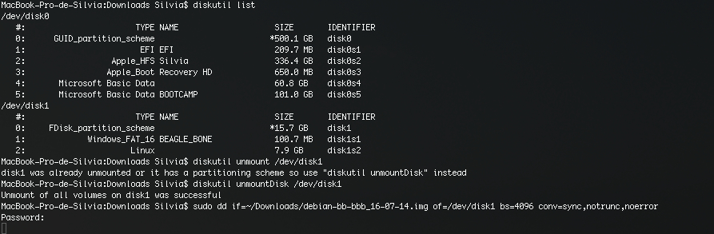

# Copiar una imagen a SDcard

#####Linux

En este [link](https://github.com/erlerobot/wiki/wiki/Copy-image-to-microSD-card) podeis encontrar instrucciones para quemar la imagen usando Linux.

#####Mac

En este sistema operativo, deben seguirse los pasos de la imagen:

El proceso tardará unos 15-20 minutos.

Después de quemar la imagen en la tarjeta, en cualquiera de los dos SO, comprueba que en Linux se montan tanto `BEAGLE_PILOT` como `rootfs`.
