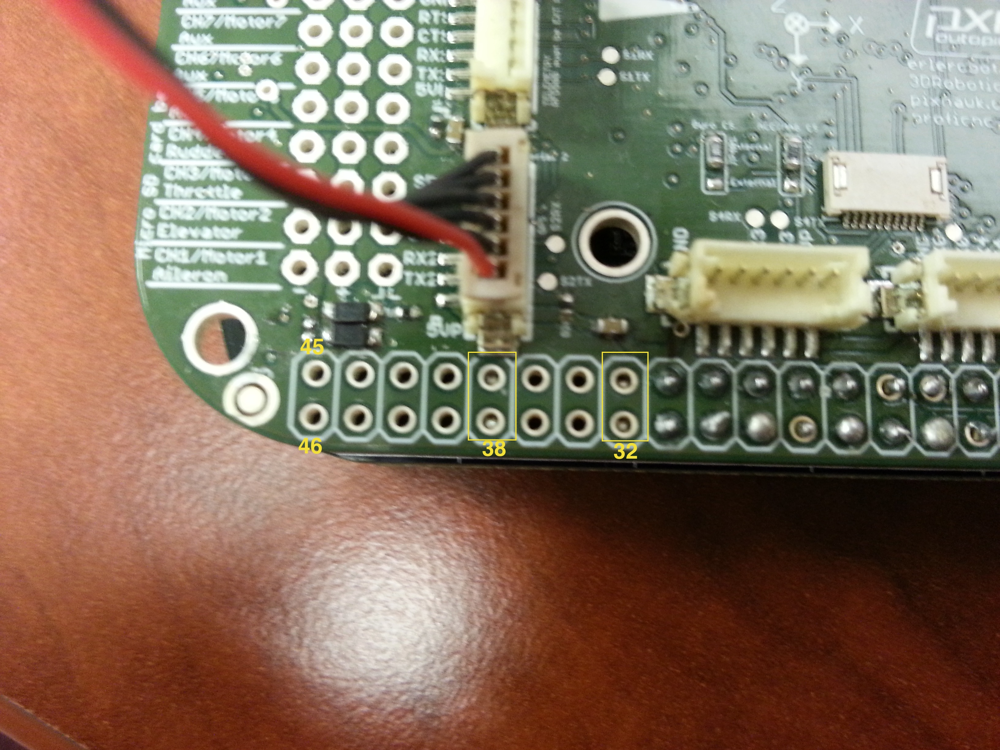

# GPS test

El teste del GPS se hace conectando el dispositivo en el serial 2 del PXF (cómo en la imagen).



A continuación, en el terminal conectado a la placa, escribimos el comando:
```
echo BB-UART5 > $SLOTS
```
y ejecutamos, por ejemplo, ArduCopter con al siguiente opción:
```
build/ArduCopter.build-MPU9250/ArduCopter.elf -B /dev/ttyO5 -A tcp:*:6000:wait
```

Para no tener que teclear el comando `echo BB-UART5 > $SLOTS` siempre que iniciemos, se puede añadir al final del archivo `.bashrc`:
```
vi ~/.bashrc
```
Insertamos el comando al final (bajando con la flecha, ESC, i) y guardamos (ESC, :wq).

Hacemos :
```
source ~/.bashrc
```
para cargar de nuevo.Así, la próxima vez que iniciemos no será necesario este comando, y podremos correr directamente ardupilot con la opción `-B...`indicada arriba.
